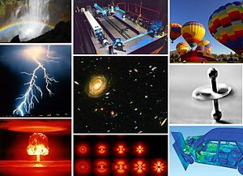

&nbsp;

Various examples of physical phenomena

&nbsp;

&nbsp;

<table class="vertical-navbox nowraplinks">
<tbody>
<tr>
<td></td>
</tr>
<tr>
<th><a class="mw-selflink selflink">Physics</a></th>
</tr>
<tr>
<td>

<ul>
<li><a title="History of physics" href="https://en.wikipedia.org/wiki/History_of_physics">History</a></li>
<li><a title="Outline of physics" href="https://en.wikipedia.org/wiki/Outline_of_physics">Outline</a></li>
<li><a title="Glossary of physics" href="https://en.wikipedia.org/wiki/Glossary_of_physics">Glossary</a></li>
<li><a title="Index of physics articles" href="https://en.wikipedia.org/wiki/Index_of_physics_articles">Index</a></li>
<li><a title="Category:Physics" href="https://en.wikipedia.org/wiki/Category:Physics">Category</a></li>
<li><a title="Portal:Physics" href="https://en.wikipedia.org/wiki/Portal:Physics">Portal</a></li>
</ul>

</td>
</tr>
</tbody>
</table>

 

<strong>Physics</strong>&nbsp;(from&nbsp;<a class="mw-redirect" title="Ancient Greek language" href="https://en.wikipedia.org/wiki/Ancient_Greek_language">Ancient Greek</a>:&nbsp;&phi;&upsilon;&sigma;&iota;&kappa;ή (ἐ&pi;&iota;&sigma;&tau;ή&mu;&eta;),&nbsp;<small><a class="mw-redirect" title="Romanization of Ancient Greek" href="https://en.wikipedia.org/wiki/Romanization_of_Ancient_Greek">romanized</a>:&nbsp;</small><em lang="grc-Latn" title="Ancient Greek-language romanization">physikḗ (epistḗmē)</em>,&nbsp;<small><a title="Literal translation" href="https://en.wikipedia.org/wiki/Literal_translation">lit.</a>&nbsp;</small>'knowledge of nature', from&nbsp;&phi;ύ&sigma;&iota;&sigmaf;&nbsp;<em>ph&yacute;sis</em>&nbsp;'nature')&nbsp;is the&nbsp;<a title="Natural science" href="https://en.wikipedia.org/wiki/Natural_science">natural science</a>&nbsp;that studies&nbsp;<a title="Matter" href="https://en.wikipedia.org/wiki/Matter">matter</a>,&nbsp;its&nbsp;<a class="mw-redirect" title="Motion (physics)" href="https://en.wikipedia.org/wiki/Motion_(physics)">motion</a>&nbsp;and behavior through&nbsp;<a title="" href="https://en.wikipedia.org/wiki/Spacetime">space and time</a>, and the related entities of&nbsp;<a title="Energy" href="https://en.wikipedia.org/wiki/Energy">energy</a>&nbsp;and&nbsp;<a title="Force" href="https://en.wikipedia.org/wiki/Force">force</a>.&nbsp;Physics is one of the most fundamental scientific disciplines, and its main goal is to understand how the&nbsp;<a title="Universe" href="https://en.wikipedia.org/wiki/Universe">universe</a>&nbsp;behaves.

Physics is one of the oldest&nbsp;<a title="Academic discipline" href="https://en.wikipedia.org/wiki/Academic_discipline">academic disciplines</a>&nbsp;and, through its inclusion of&nbsp;<a title="Astronomy" href="https://en.wikipedia.org/wiki/Astronomy">astronomy</a>, perhaps&nbsp;<em>the</em>&nbsp;oldest.&nbsp;Over much of the past two millennia, physics,&nbsp;<a title="Chemistry" href="https://en.wikipedia.org/wiki/Chemistry">chemistry</a>,&nbsp;<a title="Biology" href="https://en.wikipedia.org/wiki/Biology">biology</a>, and certain branches of&nbsp;<a title="Mathematics" href="https://en.wikipedia.org/wiki/Mathematics">mathematics</a>&nbsp;were a part of&nbsp;<a title="Natural philosophy" href="https://en.wikipedia.org/wiki/Natural_philosophy">natural philosophy</a>, but during the&nbsp;<a title="Scientific Revolution" href="https://en.wikipedia.org/wiki/Scientific_Revolution">Scientific Revolution</a>&nbsp;in the 17th century these natural sciences emerged as unique research endeavors in their own right.&nbsp;Physics intersects with many&nbsp;<a title="Interdisciplinarity" href="https://en.wikipedia.org/wiki/Interdisciplinarity">interdisciplinary</a>&nbsp;areas of research, such as&nbsp;<a title="Biophysics" href="https://en.wikipedia.org/wiki/Biophysics">biophysics</a>&nbsp;and&nbsp;<a title="Quantum chemistry" href="https://en.wikipedia.org/wiki/Quantum_chemistry">quantum chemistry</a>, and the boundaries of physics are not&nbsp;<a title="Demarcation problem" href="https://en.wikipedia.org/wiki/Demarcation_problem">rigidly defined</a>. New ideas in physics often explain the fundamental mechanisms studied by other sciences&nbsp;and suggest new avenues of research in academic disciplines such as mathematics and&nbsp;<a title="Philosophy" href="https://en.wikipedia.org/wiki/Philosophy">philosophy</a>.

Advances in physics often enable advances in new&nbsp;<a title="Technology" href="https://en.wikipedia.org/wiki/Technology">technologies</a>. For example, advances in the understanding of&nbsp;<a title="Electromagnetism" href="https://en.wikipedia.org/wiki/Electromagnetism">electromagnetism</a>,&nbsp;<a title="Solid-state physics" href="https://en.wikipedia.org/wiki/Solid-state_physics">solid-state physics</a>, and&nbsp;<a title="Nuclear physics" href="https://en.wikipedia.org/wiki/Nuclear_physics">nuclear physics</a>&nbsp;led directly to the development of new products that have dramatically transformed modern-day society, such as&nbsp;<a title="Television" href="https://en.wikipedia.org/wiki/Television">television</a>,&nbsp;<a title="Computer" href="https://en.wikipedia.org/wiki/Computer">computers</a>,&nbsp;<a class="mw-redirect" title="Domestic appliance" href="https://en.wikipedia.org/wiki/Domestic_appliance">domestic appliances</a>, and&nbsp;<a title="Nuclear weapon" href="https://en.wikipedia.org/wiki/Nuclear_weapon">nuclear weapons</a>;&nbsp;advances in&nbsp;<a title="Thermodynamics" href="https://en.wikipedia.org/wiki/Thermodynamics">thermodynamics</a>&nbsp;led to the development of&nbsp;<a class="mw-redirect" title="Industrialization" href="https://en.wikipedia.org/wiki/Industrialization">industrialization</a>; and advances in&nbsp;<a title="Mechanics" href="https://en.wikipedia.org/wiki/Mechanics">mechanics</a>&nbsp;inspired the development of&nbsp;<a title="Calculus" href="https://en.wikipedia.org/wiki/Calculus">calculus</a>.

 

<h2>Books </h2>

<ul>

                             

 <li><a target="_blank" href="https://github.com/manjunath5496/Physics-Books/blob/master/pyb(1).pdf" style="text-decoration:none;">A Heat Transfer Textbook</a></li>

 <li><a target="_blank" href="https://github.com/manjunath5496/Physics-Books/blob/master/pyb(2).pdf" style="text-decoration:none;">Quantum Field Theory: A Modern Introduction</a></li>

<li><a target="_blank" href="https://github.com/manjunath5496/Physics-Books/blob/master/pyb(3).pdf" style="text-decoration:none;">Lectures - Stephen Hawking </a></li>
 <li><a target="_blank" href="https://github.com/manjunath5496/Physics-Books/blob/master/pyb(4).pdf" style="text-decoration:none;">Nuclear and Particle Physics</a></li>                              
<li><a target="_blank" href="https://github.com/manjunath5496/Physics-Books/blob/master/pyb(5).pdf" style="text-decoration:none;">Elements of Nuclear Physics</a></li>
<li><a target="_blank" href="https://github.com/manjunath5496/Physics-Books/blob/master/pyb(6).pdf" style="text-decoration:none;">The Universe in a Nutshell</a></li>
 <li><a target="_blank" href="https://github.com/manjunath5496/Physics-Books/blob/master/pyb(7).pdf" style="text-decoration:none;">Modern Physics for Science and Engineering</a></li>

 <li><a target="_blank" href="https://github.com/manjunath5496/Physics-Books/blob/master/pyb(8).pdf" style="text-decoration:none;"> Conceptual Physics </a></li>
 
  <li><a target="_blank" href="https://github.com/manjunath5496/Physics-Books/blob/master/pyb(9).pdf" style="text-decoration:none;"> Modern Physics for Scientists and Engineers</a></li>
                              
 <li><a target="_blank" href="https://github.com/manjunath5496/Physics-Books/blob/master/pyb(10).pdf" style="text-decoration:none;">Concepts of Physics </a></li>                              

<li><a target="_blank" href="https://github.com/manjunath5496/Physics-Books/blob/master/pyb(12).pdf" style="text-decoration:none;">Essential Physics Part I</a></li>
<li><a target="_blank" href="https://github.com/manjunath5496/Physics-Books/blob/master/pyb(13).pdf" style="text-decoration:none;">Physics: An overview</a></li>
                              
<li><a target="_blank" href="https://github.com/manjunath5496/Physics-Books/blob/master/pyb(14).pdf" style="text-decoration:none;">Physics II For Dummies</a></li>
<li><a target="_blank" href="https://github.com/manjunath5496/Physics-Books/blob/master/pyb(15).pdf" style="text-decoration:none;">Radiation Physics for Medical Physicists</a></li>

<li><a target="_blank" href="https://github.com/manjunath5496/Physics-Books/blob/master/pyb(16).pdf" style="text-decoration:none;">Atomic Physics</a></li>

  <li><a target="_blank" href="https://github.com/manjunath5496/Physics-Books/blob/master/pyb(17).pdf" style="text-decoration:none;">The Grand Design</a></li>   
  
<li><a target="_blank" href="https://github.com/manjunath5496/Physics-Books/blob/master/pyb(18).pdf" style="text-decoration:none;">Mathematical Physics: Applied Mathematics for Scientists and Engineers</a></li> 
<li><a target="_blank" href="https://github.com/manjunath5496/Physics-Books/blob/master/pyb(19).pdf" style="text-decoration:none;">Fundamentals of Physics</a></li> 

<li><a target="_blank" href="https://github.com/manjunath5496/Physics-Books/blob/master/pyb(20).pdf" style="text-decoration:none;">Mathematical Methods for Physics and Engineering </a></li>

<li><a target="_blank" href="https://github.com/manjunath5496/Physics-Books/blob/master/pyb(21).pdf" style="text-decoration:none;">Quantum Physics</a></li>
<li><a target="_blank" href="https://github.com/manjunath5496/Physics-Books/blob/master/pyb(22).pdf" style="text-decoration:none;">Concepts of Modern Physics</a></li> 
 <li><a target="_blank" href="https://github.com/manjunath5496/Physics-Books/blob/master/pyb(23).pdf" style="text-decoration:none;">Semiconductor Device Physics and Design</a></li>
 

   <li><a target="_blank" href="https://github.com/manjunath5496/Physics-Books/blob/master/pyb(24).pdf" style="text-decoration:none;">Elementary Physics</a></li>
 
   <li><a target="_blank" href="https://github.com/manjunath5496/Physics-Books/blob/master/pyb(25).pdf" style="text-decoration:none;">Introduction to Elementary Particle Physics</a></li>                              
 <li><a target="_blank" href="https://github.com/manjunath5496/Physics-Books/blob/master/pyb(26).pdf" style="text-decoration:none;">Problems in General Physics</a></li>
  <li><a target="_blank" href="https://github.com/manjunath5496/Physics-Books/blob/master/pyb(27).pdf" style="text-decoration:none;">Hyperspace: A Scientific Odyssey Through Parallel Universes, Time Warps, and the 10th Dimension</a></li>
   
 
   <li><a target="_blank" href="https://github.com/manjunath5496/Physics-Books/blob/master/pyb(28).pdf" style="text-decoration:none;">1000 Solved Problems in Modern Physics </a></li>
 
   <li><a target="_blank" href="https://github.com/manjunath5496/Physics-Books/blob/master/pyb(29).pdf" style="text-decoration:none;">Tensors for Physics </a></li>                              

  <li><a target="_blank" href="https://github.com/manjunath5496/Physics-Books/blob/master/pyb(30).pdf" style="text-decoration:none;">Advanced Solid State Physics</a></li>
 
   <li><a target="_blank" href="https://github.com/manjunath5496/Physics-Books/blob/master/pyb(31).pdf" style="text-decoration:none;">SAT II Physics</a></li> 
    <li><a target="_blank" href="https://github.com/manjunath5496/Physics-Books/blob/master/pyb(32).pdf" style="text-decoration:none;">Engineering Physics</a></li> 
    <li><a target="_blank" href="https://github.com/manjunath5496/Physics-Books/blob/master/pyb(33).pdf" style="text-decoration:none;">Photography, Physics, and Complexity: Strange Bedfellows or a New Aesthetic?</a></li> 
                   
  <li><a target="_blank" href="https://github.com/manjunath5496/Physics-Books/blob/master/pyb(34).pdf" style="text-decoration:none;">Physics of Magnetism and Magnetic Materials</a></li> 
 
  <li><a target="_blank" href="https://github.com/manjunath5496/Physics-Books/blob/master/pyb(35).pdf" style="text-decoration:none;">Modern Particle Physics</a></li> 
    <li><a target="_blank" href="https://github.com/manjunath5496/Physics-Books/blob/master/pyb(36).pdf" style="text-decoration:none;">Physics and Engineering of Radiation Detection</a></li> 
  
 
<li><a target="_blank" href="https://github.com/manjunath5496/Physics-Books/blob/master/pyb(37).pdf" style="text-decoration:none;">Fundamentals of Geophysics</a></li>
 <li><a target="_blank" href="https://github.com/manjunath5496/Physics-Books/blob/master/pyb(38).pdf" style="text-decoration:none;">Teacher Education in Physics: Research, Curriculum, and Practice</a></li>
<li><a target="_blank" href="https://github.com/manjunath5496/Physics-Books/blob/master/pyb(39).pdf" style="text-decoration:none;">A Guide to Physics Problems: Part 2: Thermodynamics, Statistical Physics, and Quantum Mechanics</a></li>
 <li><a target="_blank" href="https://github.com/manjunath5496/Physics-Books/blob/master/pyb(40).pdf" style="text-decoration:none;">Physics 101: An Introduction To Physics</a></li>                              
<li><a target="_blank" href="https://github.com/manjunath5496/Physics-Books/blob/master/pyb(41).pdf" style="text-decoration:none;">Dictionary of Geophysics, Astrophysics, and Astronomy</a></li>
<li><a target="_blank" href="https://github.com/manjunath5496/Physics-Books/blob/master/pyb(42).pdf" style="text-decoration:none;">Beyond Einstein: from the Big Bang to black holes </a></li>
 
  <li><a target="_blank" href="https://github.com/manjunath5496/Physics-Books/blob/master/pyb(43).pdf" style="text-decoration:none;">Mathematics for theoretical physics</a></li>
 <li><a target="_blank" href="https://github.com/manjunath5496/Physics-Books/blob/master/pyb(44).pdf" style="text-decoration:none;">Black Holes And Baby Universes And Other Essays  </a></li>
   <li><a target="_blank" href="https://github.com/manjunath5496/Physics-Books/blob/master/pyb(45).pdf" style="text-decoration:none;">Fundamentals of Plasma Physics</a></li>
                            
<li><a target="_blank" href="https://github.com/manjunath5496/Physics-Books/blob/master/pyb(46).pdf" style="text-decoration:none;">The Physics of Waves</a></li>

<li><a target="_blank" href="https://github.com/manjunath5496/Physics-Books/blob/master/pyb(47).pdf" style="text-decoration:none;">Computational Physics</a></li>

<li><a target="_blank" href="https://github.com/manjunath5496/Physics-Books/blob/master/pyb(48).pdf" style="text-decoration:none;">Physics of the Impossible: A Scientific Exploration into the World of Phasers, Force Fields, Teleportation, and Time Travel </a></li>
                              
<li><a target="_blank" href="https://github.com/manjunath5496/Physics-Books/blob/master/pyb(49).pdf" style="text-decoration:none;">Introductory Physics II: Waves, Acoustics, Electromagnetism, Optics, and Modern Physics</a></li>
<li><a target="_blank" href="https://github.com/manjunath5496/Physics-Books/blob/master/pyb(50).pdf" style="text-decoration:none;">Polymer Physics </a></li>

<li><a target="_blank" href="https://github.com/manjunath5496/Physics-Books/blob/master/pyb(51).pdf" style="text-decoration:none;">Basic Theoretical Physics </a></li>

<li><a target="_blank" href="https://github.com/manjunath5496/Physics-Books/blob/master/pyb(53).pdf" style="text-decoration:none;">Introductory Physics II: Electricity, Magnetism and Optics</a></li>

<li><a target="_blank" href="https://github.com/manjunath5496/Physics-Books/blob/master/pyb(54).pdf" style="text-decoration:none;">Practical Physics </a></li>

<li><a target="_blank" href="https://github.com/manjunath5496/Physics-Books/blob/master/pyb(56).pdf" style="text-decoration:none;"> GRE Physics Test Practice Book</a></li>

<li><a target="_blank" href="https://github.com/manjunath5496/Physics-Books/blob/master/pyb(57).pdf" style="text-decoration:none;">The Physics of Quantum Mechanics  </a></li>

<li><a target="_blank" href="https://github.com/manjunath5496/Physics-Books/blob/master/pyb(58).pdf" style="text-decoration:none;">Mathematical Tools for Physics  </a></li>

 <li><a target="_blank" href="https://github.com/manjunath5496/Physics-Books/blob/master/pyb(59).pdf" style="text-decoration:none;">Physics Problem Solving in Cooperative Learning Groups </a></li>

 <li><a target="_blank" href="https://github.com/manjunath5496/Physics-Books/blob/master/pyb(60).pdf" style="text-decoration:none;">An Introduction to Black Holes, Information and the String Theory Revolution</a></li>

 <li><a target="_blank" href="https://github.com/manjunath5496/Physics-Books/blob/master/pyb(62).pdf" style="text-decoration:none;">A Briefer History of Time</a></li>                              
<li><a target="_blank" href="https://github.com/manjunath5496/Physics-Books/blob/master/pyb(63).pdf" style="text-decoration:none;">Statistical Physics </a></li>
<li><a target="_blank" href="https://github.com/manjunath5496/Physics-Books/blob/master/pyb(64).pdf" style="text-decoration:none;">Parallel Worlds: A Journey Through Creation, Higher Dimensions, and the Future of the Cosmos</a></li>
 <li><a target="_blank" href="https://github.com/manjunath5496/Physics-Books/blob/master/pyb(65).pdf" style="text-decoration:none;">The Poetry of Physics and The Physics of Poetry</a></li>

 <li><a target="_blank" href="https://github.com/manjunath5496/Physics-Books/blob/master/pyb(66).pdf" style="text-decoration:none;"> A-Level Physics Revision notes 2015 </a></li>
                              
 <li><a target="_blank" href="https://github.com/manjunath5496/Physics-Books/blob/master/pyb(67).pdf" style="text-decoration:none;">Electromagnetic Field Theory </a></li>                              
<li><a target="_blank" href="https://github.com/manjunath5496/Physics-Books/blob/master/pyb(68).pdf" style="text-decoration:none;">Determinants and Their Applications in Mathematical Physics</a></li>
<li><a target="_blank" href="https://github.com/manjunath5496/Physics-Books/blob/master/pyb(69).pdf" style="text-decoration:none;">The Cambridge Handbook of Physics Formulas</a></li>
<li><a target="_blank" href="https://github.com/manjunath5496/Physics-Books/blob/master/pyb(70).pdf" style="text-decoration:none;">Applied Mathematical Methods in Theoretical Physics</a></li>
                              
<li><a target="_blank" href="https://github.com/manjunath5496/Physics-Books/blob/master/pyb(71).pdf" style="text-decoration:none;">Introduction to string field theory</a></li>
<li><a target="_blank" href="https://github.com/manjunath5496/Physics-Books/blob/master/pyb(72).pdf" style="text-decoration:none;">Introduction to Particle Physics</a></li>

<li><a target="_blank" href="https://github.com/manjunath5496/Physics-Books/blob/master/pyb(73).pdf" style="text-decoration:none;">A Brief History of Time</a></li>

  <li><a target="_blank" href="https://github.com/manjunath5496/Physics-Books/blob/master/pyb(74).pdf" style="text-decoration:none;">The Theory of Everything</a></li>   
  
<li><a target="_blank" href="https://github.com/manjunath5496/Physics-Books/blob/master/pyb(75).pdf" style="text-decoration:none;">Formulae Sheet for Physics</a></li> 
<li><a target="_blank" href="https://github.com/manjunath5496/Physics-Books/blob/master/pyb(76).pdf" style="text-decoration:none;">Equations in Physics</a></li> 

<li><a target="_blank" href="https://github.com/manjunath5496/Physics-Books/blob/master/pyb(78).pdf" style="text-decoration:none;">Physics pocket diary of concepts and formulas </a></li>

 <li><a target="_blank" href="https://github.com/manjunath5496/Physics-Books/blob/master/pyb(11).pdf" style="text-decoration:none;">Cosmos</a></li>   
  
<li><a target="_blank" href="https://github.com/manjunath5496/Physics-Books/blob/master/pyb(52).pdf" style="text-decoration:none;">Pale Blue Dot</a></li> 
<li><a target="_blank" href="https://github.com/manjunath5496/Physics-Books/blob/master/pyb(55).pdf" style="text-decoration:none;">Dragons of Eden</a></li> 

<li><a target="_blank" href="https://github.com/manjunath5496/Physics-Books/blob/master/pyb(61).pdf" style="text-decoration:none;">Brief Answers to the Big Questions </a></li>

<li><a target="_blank" href="https://github.com/manjunath5496/Physics-Books/blob/master/pyb(77).pdf" style="text-decoration:none;">The Nature of Space and Time </a></li>

<li><a target="_blank" href="https://github.com/manjunath5496/Physics-Books/blob/master/pyb(79).pdf" style="text-decoration:none;">Introductory Physics I: Elementary Mechanics </a></li>

<li><a target="_blank" href="https://github.com/manjunath5496/Physics-Books/blob/master/pyb(80).pdf" style="text-decoration:none;">Physics Workbook For Dummies </a></li>

<li><a target="_blank" href="https://github.com/manjunath5496/Physics-Books/blob/master/pyb(81).pdf" style="text-decoration:none;">Quantum Physics For Dummies </a></li>

<li><a target="_blank" href="https://github.com/manjunath5496/Physics-Books/blob/master/pyb(82).pdf" style="text-decoration:none;">Nuclear Physics </a></li>

<li><a target="_blank" href="https://github.com/manjunath5496/Physics-Books/blob/master/pyb(83).pdf" style="text-decoration:none;">Physics Olympiad — Basic to Advanced Exercises  </a></li>

<li><a target="_blank" href="https://github.com/manjunath5496/Physics-Books/blob/master/pyb(84).pdf" style="text-decoration:none;">Tensors for Physics </a></li>

<li><a target="_blank" href="https://github.com/manjunath5496/Physics-Books/blob/master/pyb(85).pdf" style="text-decoration:none;"> Introduction to Modern Optics </a></li>

<li><a target="_blank" href="https://github.com/manjunath5496/Physics-Books/blob/master/pyb(86).pdf" style="text-decoration:none;">200 More Puzzling Physics Problems: With Hints and Solutions </a></li>

<li><a target="_blank" href="https://github.com/manjunath5496/Physics-Books/blob/master/pyb(87).pdf" style="text-decoration:none;">The Feynman Lectures on Physics</a></li>

<li><a target="_blank" href="https://github.com/manjunath5496/Physics-Books/blob/master/pyb(88).pdf" style="text-decoration:none;">IIT JEE Super Course in Physics: Optics and Modern Physics </a></li>

<li><a target="_blank" href="https://github.com/manjunath5496/Physics-Books/blob/master/pyb(89).pdf" style="text-decoration:none;">Fundamentals of Nuclear Reactor Physics</a></li>

</ul>
